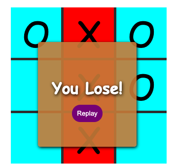

# JS_TicTacToe
An unbeatable tic tac toe game using vanilla JavaScript, HTML, and CSS and the Minimax algorithm!  

Deployed at: [https://robert-schwartz.github.io/JS_TicTacToe/](https://robert-schwartz.github.io/JS_TicTacToe/)  

  

##  MiniMax function will do the following:
1.  Return a value if a terminal state is found (+10,0,-10)
2.  Go through available spots on the board
3.  Call the minimax function on each available spot (recursion)
4.  evaluate returning values from function calls
5.  Returns the best value
